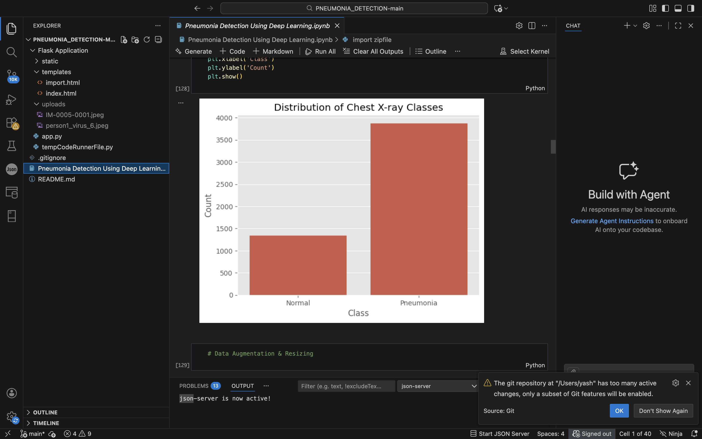
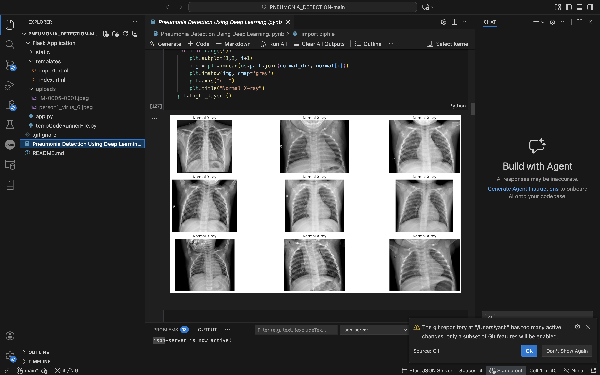

# PNEUMONIA_DETECTION
## 🩺 Pneumonia Detection Using Deep Learning

This project uses Convolutional Neural Networks (CNNs) to detect pneumonia from chest X-ray images.

## 🔍 Exploratory Data Analysis

### Normal Chest X-ray Samples

### Dataset Class Distribution

## 🧠 Model & Techniques
- CNN-based image classification
- Data augmentation & normalization
- TensorFlow / Keras
- OpenCV & Matplotlib for visualization
